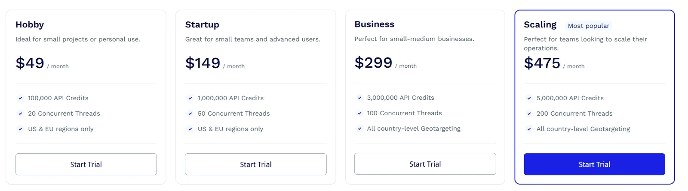

# ScraperAPI Review – Simple Web Scraping That Actually Works

So you want to scrape websites but keep running into blocks, CAPTCHAs, and IP bans? Yeah, that's the fun part of web scraping—except it's not fun at all. ScraperAPI basically takes all those headaches off your plate. It's a cloud service that sits between your code and the websites you're trying to scrape, handling all the annoying stuff automatically. You just send your requests, and it figures out the proxy rotation, solves the CAPTCHAs, and makes sure you actually get your data back. The whole point is letting you focus on what you're building instead of fighting with infrastructure.

---

## What Makes It Worth Looking At

Here's what ScraperAPI brings to the table:

**Automatic Proxy Rotation** – They've got over 40 million IPs spread across residential, mobile, and datacenter networks. Your requests bounce around automatically, so sites can't easily flag you.

**CAPTCHA Solving** – Built right in. When a CAPTCHA pops up, the system detects it and handles it for you. Most of the time, you won't even know it happened.

**Geotargeting** – Need data from a specific country or city? You can tell it where to appear from. Useful if you're tracking regional pricing or content.

**JavaScript Rendering** – Plenty of modern sites load everything with JavaScript. ScraperAPI can fire up a headless browser to grab that dynamically loaded content.

**Scalability** – Whether you're making a few hundred requests or millions, it handles the load without much drama.



## Getting It Running

Integration is pretty straightforward. You're basically just sending your regular scraping request through ScraperAPI's endpoint, tossing in your API key. It works with whatever you're already using—BeautifulSoup, Scrapy, Puppeteer, Playwright, you name it.

Here's a quick example:

```python
import requests

api_key = "YOUR_API_KEY"
url = "http://httpbin.org/ip"
response = requests.get(f"http://api.scraperapi.com?api_key={api_key}&url={url}")
print(response.text)
```

That's it. No messing around with proxy lists or retry logic. You send the request, it does its thing, you get your data.

## How It Actually Performs

In real-world testing, response times were solid. Success rates consistently hung above 99%, even on sites with aggressive anti-bot systems. 👉 [See how ScraperAPI handles even the toughest anti-scraping measures](https://www.scraperapi.com/?fp_ref=coupons) and keeps your data pipeline running smoothly.

JavaScript rendering does add a bit of latency—that's expected since it's spinning up a browser instance—but it handles complex, interactive pages reliably. If you're scraping mostly static HTML, you'll be fine. If you're dealing with single-page apps or heavy client-side rendering, the JS mode gets the job done without much fuss.

## What It Costs

Plans start at **$49/month** for 100,000 API credits. They also offer a free 7-day trial with 5,000 credits, which is enough to test things out and see if it fits your workflow. Higher-tier plans unlock more concurrent requests and you get assigned account managers if you need that level of support.


One credit equals one request. Features like JavaScript rendering consume more credits per request, so keep that in mind when estimating costs. For most use cases, though, the pricing is pretty transparent.

## The Upsides

**No infrastructure management** – You don't need to maintain proxy pools, monitor IP health, or handle CAPTCHA services separately. It's all bundled in.

**High success rate** – Even on sites that actively fight scrapers, the system keeps your requests going through.

**Easy to integrate** – Minimal code changes. If you're already scraping, you can swap in ScraperAPI in minutes.

**Geotargeting flexibility** – Being able to specify location is huge for regional data collection or testing localized content.

## The Downsides

**Costs scale with usage** – If you're running massive scraping operations, the bills can climb quickly. You'll want to optimize your requests to avoid burning through credits.

**Rendering adds delay** – JavaScript rendering is slower than straight HTML requests. It's necessary for certain sites, but it does impact speed.

## Common Questions People Ask

**What is ScraperAPI?**  
It's a cloud-based scraping service that automatically handles proxies, CAPTCHAs, and browser headers so you don't have to. You send requests through their API, and they return clean data.

**How does ScraperAPI work?**  
You pass your target URL and API key to ScraperAPI's endpoint. It routes your request through rotating proxies, solves any CAPTCHAs or challenges, and sends back the HTML or JSON you need.

**Do I need to manage my own proxies?**  
Nope. The service includes access to over 40 million residential, mobile, and datacenter IPs with automatic rotation.

**Can ScraperAPI scrape JavaScript-heavy websites?**  
Yes. It has a JavaScript rendering option that uses headless browsers to load and scrape sites that rely on client-side rendering.

**Is there a free trial?**  
Yeah, there's a 7-day free trial with 5,000 API credits. Enough to test things out before committing to a paid plan.

**Is my scraping activity legal?**  
That depends on the website's terms of service and the laws in your area. Always make sure you're allowed to access and use the data you're scraping.

**How is pricing calculated?**  
By API credits. One credit = one request. Features like JavaScript rendering cost extra credits per request.

**Who should use ScraperAPI?**  
Developers, data analysts, marketers, and businesses that need web data at scale without the hassle of managing proxies or solving CAPTCHAs manually.

---

## Bottom Line

ScraperAPI is a solid, developer-friendly option if you're doing large-scale web scraping and don't want to deal with the operational mess. Whether you're tracking e-commerce prices, gathering market intelligence, or monitoring SEO metrics, it delivers the speed, stability, and flexibility you need. 👉 [Get started with ScraperAPI's free trial](https://www.scraperapi.com/?fp_ref=coupons) and see why it's the go-to solution for hassle-free web scraping at any scale.
